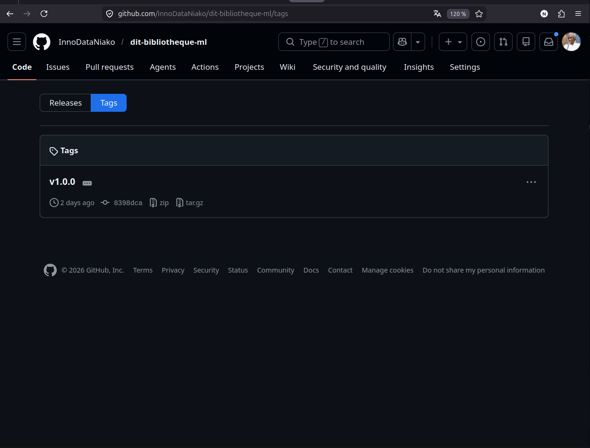

# BiblioPro DIT - Bibliothèque Numérique Intelligente


**Plateforme de gestion de bibliothèque académique avec système de recommandation par Intelligence Artificielle.**

🌐 **Démo en ligne** : [https://dit-bibliotheque-ml-v1.vercel.app](https://dit-bibliotheque-ml-v1.vercel.app)

---

## Table des matières

1. [Contexte et problématique](#contexte-et-problématique)
2. [Notre solution](#notre-solution)
3. [Architecture technique](#architecture-technique)
4. [Technologies utilisées](#technologies-utilisées)
5. [Structure du projet](#structure-du-projet)
6. [Branches Git Flow](#branches-git-flow)
7. [Installation et lancement](#installation-et-lancement)
8. [Services API](#services-api)
9. [Tests des endpoints](#tests-des-endpoints)
10. [Système de recommandation IA](#système-de-recommandation-ia)
11. [DVC - Data Version Control](#dvc---data-version-control)
12. [Captures d'écran](#captures-décran)
13. [Comptes de test](#comptes-de-test)
14. [Perspectives d'évolution](#perspectives-dévolution)
15. [Auteur](#auteur)

---

## Contexte et problématique

Le **Dakar Institute of Technology (DIT)** gère actuellement sa bibliothèque de manière manuelle, ce qui entraîne plusieurs difficultés :

- **Absence de suivi centralisé** des livres et des emprunts
- **Impossibilité de produire des statistiques fiables** sur l'utilisation des ressources
- **Gestion inefficace** des retards et des relances
- **Manque d'accès numérique** pour les étudiants et le corps professoral

**Objectif :** Déployer une plateforme web moderne, scalable et intelligente pour répondre à l'ensemble de ces enjeux.

---

## Notre solution

**BiblioPro DIT** est une plateforme web complète reposant sur une architecture microservices.

### Administrateur

L'administrateur dispose d'un **dashboard dédié** offrant :

| Fonctionnalité | Description |
|----------------|-------------|
| **Vue d'ensemble** | Statistiques en temps réel : nombre de livres, utilisateurs, emprunts, retards |
| **Gestion du catalogue** | Ajout, modification et suppression de livres avec upload de l'image de couverture |
| **Gestion des catégories** | Création de catégories personnalisées avec code couleur |
| **Gestion des emprunts** | Consultation de tous les emprunts, enregistrement des retours, export CSV |
| **Gestion des utilisateurs** | Visualisation des comptes, rôles et statuts |
| **Accès utilisateur** | Navigation sur le site comme un utilisateur standard pour vérifier le rendu |
| **Recommandations IA** | Possibilité de générer des recommandations pour n'importe quel utilisateur |

### Autres rôles

| Rôle | Fonctionnalités |
|------|-----------------|
| **Bibliothécaire** | Droits administrateur pour la gestion quotidienne : catalogue, emprunts, retours, historique, export CSV |
| **Étudiant** | Catalogue avec filtres et recherche, emprunt en 1 clic (durée : **5 jours**), suivi des emprunts avec jours restants, recommandations IA personnalisées, favoris avec compteur dans la navbar |
| **Professeur** | Mêmes fonctionnalités que l'étudiant avec une durée d'emprunt étendue à **10 jours** |

---

## Architecture technique

L'application repose sur une **architecture microservices** conteneurisée avec Docker. Chaque service est indépendant, déployable isolément, et communique via des API REST.

### Services

| Service | Technologie | Responsabilité |
|---------|-------------|----------------|
| **Auth** | Flask + PyJWT + Bcrypt | Authentification, génération de tokens JWT, gestion des rôles |
| **Livres** | Flask + PostgreSQL | CRUD du catalogue, recherche multicritère, upload d'images, gestion des catégories |
| **Utilisateurs** | Flask + PostgreSQL | Gestion des profils et filtrage par type (Étudiant, Professeur, Personnel) |
| **Emprunts** | Flask + PostgreSQL | Cycle de vie des emprunts, détection automatique des retards, export CSV |
| **Recommandation IA** | FastAPI + Scikit-learn | Modèle SVD, recommandations personnalisées, endpoint de ré-entraînement |
| **Frontend** | React 18 + React Router | Interface SPA avec vues utilisateur et administrateur |

Tous les services partagent une **base de données PostgreSQL** unique, conteneurisée avec des volumes Docker pour la persistance.

### Diagramme d'architecture


---

## Technologies utilisées

| Composant | Technologie | Justification |
|-----------|-------------|---------------|
| **Frontend** | React 18 + React Router v6 + React Icons | Interface réactive, composants réutilisables, navigation SPA |
| **Backend Auth** | Flask + PyJWT + Bcrypt | Authentification robuste avec tokens signés |
| **Backend Métier** | Flask + psycopg2 | APIs RESTful avec accès PostgreSQL |
| **Backend IA** | FastAPI + Scikit-learn | Performances asynchrones, modèle SVD |
| **Base de données** | PostgreSQL 15 | Fiabilité, support des relations complexes |
| **Conteneurisation** | Docker + Docker Compose | Portabilité, isolation, profils dev/prod |
| **Versioning Code** | Git + Git Flow | Collaboration structurée, branches feature |
| **Versioning Data/ML** | DVC | Reproducibilité des données et des modèles |
| **Déploiement** | Vercel | Déploiement continu du frontend |
| **CI/CD** | GitHub Actions | Tests automatisés et build des images Docker |

---

## Structure du projet

```
bibliotheque-dit/
├── .github/workflows/            # CI/CD GitHub Actions
├── services/
│   ├── auth/                     # Service Authentification (JWT + Bcrypt)
│   │   ├── app.py                # Endpoints login, register, me, users
│   │   ├── config.py             # Configuration DB
│   │   ├── requirements.txt
│   │   └── Dockerfile
│   ├── livres/                   # Service Livres & Catégories
│   │   ├── app.py                # CRUD livres, catégories, upload, wishlist
│   │   ├── config.py
│   │   ├── requirements.txt
│   │   └── Dockerfile
│   ├── utilisateurs/             # Service Utilisateurs
│   ├── emprunts/                 # Service Emprunts (Export CSV)
│   ├── recommandation/           # Service IA (FastAPI + SVD/KNN)
│   │   ├── app/
│   │   │   ├── __init__.py
│   │   │   ├── main.py           # Endpoints /train et /recommandations
│   │   │   ├── model.py          # Algorithme SVD + KNN
│   │   │   └── database.py       # Connexion PostgreSQL
│   │   ├── model/                # Modèles ML sauvegardés
│   │   ├── requirements.txt
│   │   └── Dockerfile            # Multi-stage (dev/prod)
│   └── frontend/                 # Application React
│       ├── src/
│       │   ├── pages/            # Dashboard, Catalogue, MesEmprunts, Favoris, Profil
│       │   │   └── admin/        # Dashboard, Livres, Catégories, Emprunts, Users
│       │   ├── components/       # Navbar, AdminSidebar, AdminLayout, Footer
│       │   ├── context/          # AuthContext (JWT)
│       │   └── services/         # api.js (routes centralisées)
│       ├── public/
│       ├── package.json
│       └── Dockerfile            # Multi-stage (dev/prod)
├── data/                         # Données versionnées DVC
├── dvc/                          # Scripts du pipeline
│   ├── preprocess.py             # Nettoyage des données
│   ├── train.py                  # Entraînement SVD
│   └── evaluate.py               # Calcul métriques RMSE/MAE
├── db/init.sql                   # Script d'initialisation PostgreSQL
├── docker-compose.yml            # Orchestration (profils dev/prod)
├── dvc.yaml                      # Définition du pipeline DVC
├── dvc.lock                      # Versions figées
└── README.md
```

---

## Branches Git Flow

Le projet suit la méthodologie **Git Flow** :


| Branche | Rôle | Contenu |
|---------|------|---------|
| `main` | Production | Version stable et livrable |
| `develop` | Intégration | Fusion de toutes les features |
| `feature/service-auth` | Feature | Authentification JWT + Frontend complet |
| `feature/service-livres` | Feature | CRUD Livres avec upload d'image |
| `feature/service-utilisateurs` | Feature | CRUD Utilisateurs avec filtrage par type |
| `feature/service-emprunts` | Feature | Emprunts, retours, retards, export CSV |
| `feature/service-recommandation` | Feature | API FastAPI + modèle SVD/KNN |
| `feature/dvc-pipeline` | Feature | Pipeline DVC (preprocess, train, evaluate) |
| `feature/frontend` | Feature | Interface React |

---

## Installation et lancement

### Prérequis

- **Docker** & **Docker Compose** (version 3.8+)
- **Python 3.9+** (pour DVC)
- **Git**

### Lancement rapide

```bash
# 1. Cloner le dépôt
git clone https://github.com/InnoDataNiako/dit-bibliotheque-ml.git
cd dit-bibliotheque-ml

# 2. Lancer l'ensemble des services (mode développement)
docker compose --profile dev up -d

# 3. Vérifier l'état des services
docker compose ps

# 4. Accéder au frontend
# Ouvrir http://localhost:3000 dans le navigateur
```

### Services exposés

| Service | URL | Description |
|---------|-----|-------------|
| **Frontend React** | http://localhost:3000 | Interface utilisateur |
| **API Auth** | http://localhost:8084 | Authentification JWT |
| **API Livres** | http://localhost:8081 | CRUD Livres & Catégories |
| **API Utilisateurs** | http://localhost:8082 | Gestion des profils |
| **API Emprunts** | http://localhost:8083 | Gestion des emprunts |
| **API Recommandation IA** | http://localhost:8000 | Moteur de recommandation |
| **PostgreSQL** | localhost:5433 | Base de données |

---

## Services API

### Authentification (port 8084)

| Méthode | Endpoint | Description | Auth requise |
|---------|----------|-------------|:---:|
| `POST` | `/api/auth/login` | Connexion utilisateur | Non |
| `POST` | `/api/auth/register` | Inscription | Non |
| `GET` | `/api/auth/me` | Profil de l'utilisateur connecté | Oui |
| `GET` | `/api/auth/users` | Liste de tous les utilisateurs | Admin |

### Livres & Catégories (port 8081)

| Méthode | Endpoint | Description |
|---------|----------|-------------|
| `GET` | `/api/livres` | Liste de tous les livres |
| `POST` | `/api/livres` | Ajouter un livre |
| `PUT` | `/api/livres/{id}` | Modifier un livre |
| `DELETE` | `/api/livres/{id}` | Supprimer un livre |
| `GET` | `/api/livres/search?q=&type=` | Recherche multicritère (titre, auteur, ISBN) |
| `POST` | `/api/livres/upload` | Upload d'une image de couverture |
| `GET` | `/api/categories` | Liste des catégories |
| `POST` | `/api/categories` | Créer une catégorie |
| `PUT` | `/api/categories/{id}` | Modifier une catégorie |
| `DELETE` | `/api/categories/{id}` | Supprimer une catégorie |
| `GET` | `/api/wishlist/{userId}` | Favoris d'un utilisateur |
| `POST` | `/api/wishlist/toggle` | Ajouter/Retirer un favori |

### Emprunts (port 8083)

| Méthode | Endpoint | Description |
|---------|----------|-------------|
| `GET` | `/api/emprunts` | Tous les emprunts (avec email utilisateur) |
| `POST` | `/api/emprunts` | Emprunter un livre |
| `PUT` | `/api/emprunts/{id}/retour` | Retourner un livre |
| `GET` | `/api/emprunts/utilisateur/{id}` | Historique des emprunts d'un utilisateur |
| `GET` | `/api/emprunts/retards` | Détection des livres en retard |
| `GET` | `/api/emprunts/export` | Export CSV pour le Machine Learning |

### Recommandation IA (port 8000)

| Méthode | Endpoint | Description |
|---------|----------|-------------|
| `GET` | `/recommandations/{user_id}` | Recommandations personnalisées pour un utilisateur |
| `POST` | `/train` | Ré-entraînement du modèle SVD |

---

## Tests des endpoints

### Service Auth

```bash
# Connexion administrateur
curl -X POST http://localhost:8084/api/auth/login \
  -H "Content-Type: application/json" \
  -d '{"email":"admin@dit.sn","password":"admin123"}'

# Inscription d'un nouvel étudiant
curl -X POST http://localhost:8084/api/auth/register \
  -H "Content-Type: application/json" \
  -d '{"nom":"Test","prenom":"User","email":"test@dit.sn","password":"pass123","role":"etudiant"}'
```

### Service Livres

```bash
# Lister tous les livres
curl http://localhost:8081/api/livres

# Rechercher un livre par titre
curl "http://localhost:8081/api/livres/search?q=Python&type=titre"

# Ajouter un nouveau livre
curl -X POST http://localhost:8081/api/livres \
  -H "Content-Type: application/json" \
  -d '{"titre":"Nouveau Livre","auteur":"Auteur","isbn":"123-456-789"}'
```

### Service Emprunts

```bash
# Emprunter un livre
curl -X POST http://localhost:8083/api/emprunts \
  -H "Content-Type: application/json" \
  -d '{"email":"oumar.ba@dit.sn","livre_id":10}'

# Voir tous les emprunts
curl http://localhost:8083/api/emprunts

# Exporter les données en CSV
curl http://localhost:8083/api/emprunts/export
```

### Service Recommandation IA

```bash
# Entraîner le modèle
curl -X POST http://localhost:8000/train

# Obtenir des recommandations pour l'utilisateur #1
curl http://localhost:8000/recommandations/1
```

---

## Système de recommandation IA

Le moteur de recommandation utilise une approche de **filtrage collaboratif** basée sur l'historique des emprunts.

### Algorithmes

| Algorithme | Rôle |
|------------|------|
| **SVD (Singular Value Decomposition)** | Factorisation de la matrice utilisateur-livre pour identifier les facteurs latents |
| **KNN (K-Nearest Neighbors)** | Calcul de similarité entre les livres |
| **Cold Start** | Pour les nouveaux utilisateurs sans historique : recommandation des livres les plus populaires |

### Métriques d'évaluation

| Version | RMSE | MAE | Utilisateurs analysés | Livres analysés |
|---------|------|-----|----------------------|-----------------|
| v1.0 | 0.5 | 0.25 | 9 | 9 |

---

## DVC - Data Version Control

**DVC (Data Version Control)** garantit la **reproductibilité** des expérimentations Machine Learning en versionnant les données et les modèles au même titre que le code source.

### Pipeline (3 étapes)

```
loans.csv ──► preprocess.py ──► loans_clean.csv ──► train.py ──► model.pkl
                                                         │
                                                         ▼
                                                   metrics.json
                                                         │
                                                         ▼
                                                   evaluate.py
```

| Étape | Script | Entrée | Sortie | Description |
|-------|--------|--------|--------|-------------|
| **Preprocessing** | `dvc/preprocess.py` | `data/loans.csv` | `data/loans_clean.csv` | Nettoyage : suppression des valeurs manquantes et des doublons |
| **Entraînement** | `dvc/train.py` | `data/loans_clean.csv` | `data/model.pkl` + `data/metrics.json` | Entraînement du modèle SVD et calcul des métriques RMSE/MAE |
| **Évaluation** | `dvc/evaluate.py` | `data/metrics.json` | Console | Affichage et validation des performances |

### Commandes essentielles

```bash
dvc init                  # Initialiser DVC dans le projet
dvc repro                 # Exécuter le pipeline complet
dvc metrics show          # Afficher les métriques (RMSE, MAE)
dvc metrics diff          # Comparer deux versions du modèle
dvc push                  # Pousser les données vers le remote storage
```

### Résultat de l'exécution


### Métriques actuelles

```
Path               mae    rmse
data/metrics.json  0.25   0.5
```


---

## Captures d'écran

### Interface Utilisateur

| Connexion | Accueil | Catalogue |
|-----------|---------|-----------|
|  |  |  |

| Mes Emprunts | Favoris | Recommandations IA |
|--------------|---------|-------------------|
|  |  |  |

| Profil |
|--------|
|  |

### Interface Administrateur

| Dashboard Admin | Gestion des Livres | Gestion des Catégories |
|-----------------|-------------------|------------------------|
|  |  |  |

| Gestion des Emprunts | Gestion des Utilisateurs | Recommandations (admin) |
|----------------------|-------------------------|--------------------------|
|  |  |  |

### Infrastructure & DevOps

| Dépôt GitHub | Branches Git | GitHub Actions CI/CD |
|-------------|-------------|---------------------|
|  |  |  |

| Docker Compose | DVC Pipeline | Métriques DVC | Tags Release |
|----------------|--------------|---------------|--------------|
|  |  |  |  |

---

## Comptes de test

| Rôle | Email | Mot de passe |
|------|-------|-------------|
| **Administrateur** | `admin@dit.sn` | `admin123` |
| **Bibliothécaire** | `biblio@dit.sn` | `admin123` |
| **Étudiant** | `moussa@student.sn` | `pass123` |
| **Étudiant** | `oumar.ba@dit.sn` | `pass123` |

---

## Perspectives d'évolution

| Fonctionnalité | Description |
|----------------|-------------|
| **Notifications email** | Envoi automatique de rappels avant la date de retour et alertes de retard |
| **Scan ISBN** | Ajout de livres par scan du code-barres via la caméra |
| **Application mobile** | Version React Native pour iOS et Android |
| **Paiement en ligne** | Système d'amendes pour les retards via Wave ou Orange Money |
| **Authentification OAuth2** | Connexion via Google, LinkedIn ou comptes universitaires |
| **Tableau de bord avancé** | Graphiques d'analyse des emprunts par période, catégorie et utilisateur |
| **Déploiement Kubernetes** | Orchestration avancée pour la mise en production à grande échelle |
| **API Gateway** | Centralisation des APIs avec rate limiting et monitoring |

---

## Auteur

**Niako Kebe**

- 📧 Email : [kebeniako17@gmail.com](mailto:kebeniako17@gmail.com)
- 🐙 GitHub : [InnoDataNiako](https://github.com/InnoDataNiako)

---

*Projet académique — Master 2 Intelligence Artificielle — Dakar Institute of Technology (DIT) — Mai 2026*
```
