# 📚 BiblioPro DIT - Bibliothèque Numérique Intelligente


Plateforme de gestion de bibliothèque académique avec un **système de recommandation par Intelligence Artificielle**.

🌐 **Démo en ligne** : [https://dit-bibliotheque-ml-v1.vercel.app](https://dit-bibliotheque-ml-v1.vercel.app)

---

## 📖 Table des matières

- [Contexte et problématique](#contexte-et-problématique)
- [Notre solution](#notre-solution)
- [Architecture technique](#architecture-technique)
- [Technologies utilisées](#technologies-utilisées)
- [Structure du projet](#structure-du-projet)
- [Branches Git Flow](#branches-git-flow)
- [Installation et lancement](#installation-et-lancement)
- [Services API](#services-api)
- [Système de recommandation IA](#système-de-recommandation-ia)
- [DVC - Data Version Control](#dvc---data-version-control)
- [Captures d'écran](#captures-décran)
- [Comptes de test](#comptes-de-test)
- [Auteur](#auteur)

---

##  Contexte et problématique

L'université **Dakar Institute of Technology (DIT)** gère actuellement sa bibliothèque de manière manuelle, ce qui entraîne :

- Difficulté de suivi des livres et des emprunts
- Absence de statistiques fiables sur l'utilisation des ressources
- Gestion inefficace des retours et des retards
- Manque d'accès numérique pour les étudiants et professeurs

La direction du DIT souhaite une **plateforme web moderne** capable de répondre à ces enjeux.

---

##  Notre solution

**BiblioPro DIT** est une plateforme web  offrant :

###  Administrateur

L'administrateur dispose d'un **dashboard dédié** avec :

- **Vue d'ensemble** : statistiques en temps réel (livres, utilisateurs, emprunts, retards)
- **Gestion du catalogue** : ajout, modification, suppression de livres + upload d'image
- **Gestion des catégories** : création personnalisée avec code couleur
- **Gestion des emprunts** : consultation, enregistrement des retours, export CSV
- **Gestion des utilisateurs** : visualisation des comptes, rôles et statuts
- **Accès au site utilisateur** : navigation comme un utilisateur standard pour vérifier le rendu
-**Il Peut choisir l'ID** de n'importe quel utilisateur pour générer des recommandations personnalisées. Utile pour vérifier les suggestions de chaque lecteur.

### 👥 Autres rôles

| Rôle | Fonctionnalités |
|---|---|
| **Bibliothécaire** | Mêmes droits que l'administrateur pour la gestion quotidienne : gérer le catalogue, enregistrer emprunts et retours, consulter l'historique, exporter les données CSV |
| **Étudiant** | Catalogue avec filtres et recherche, emprunt en 1 clic , suivi des emprunts (jours restants), recommandations IA personnalisées, favoris (avec compteur dans la navbar) |
| **Professeur** | Mêmes fonctionnalités que l'étudiant, mais durée de prêt étendue |

---

##  Architecture technique

L'application repose sur une **architecture microservices** conteneurisée avec Docker. Chaque service est indépendant et communique via des API REST.

| Service | Technologies | Responsabilités |
|---|---|---|
| **Auth** | Flask, JWT, Bcrypt | Authentification, tokens JWT, vérification des rôles, hashage mots de passe |
| **Livres** | Flask, PostgreSQL | CRUD livres/catégories, recherche multicritère, upload images |
| **Utilisateurs** | Flask, PostgreSQL | Gestion des profils (Étudiant, Professeur, Personnel) |
| **Emprunts** | Flask, PostgreSQL | Cycle emprunts/retours, détection retards, export CSV |
| **Recommandation IA** | FastAPI, Scikit-learn | Système de recommandation SVD, réentraînement via API |
| **Frontend SPA** | React 18, React Router | Interface utilisateur + dashboard admin |

Tous les services partagent une **base PostgreSQL unique**, conteneurisée avec volumes Docker.

###  Diagramme d'architecture

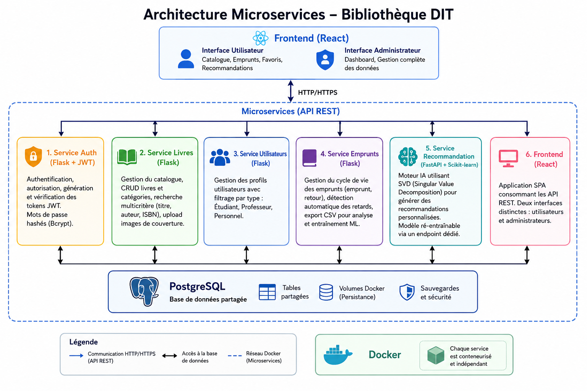

---

##  Technologies utilisées

| Composant | Technologie |
|-----------|-------------|
| **Frontend** | React 18 + React Router v6 + React Icons |
| **Backend Auth** | Flask + JWT + Bcrypt |
| **Backend Livres/Emprunts** | Flask + PostgreSQL |
| **Backend IA** | FastAPI + Scikit-learn (SVD) |
| **Base de données** | PostgreSQL 15 |
| **Conteneurisation** | Docker + Docker Compose |
| **Versioning Code** | Git + Git Flow |
| **Versioning Data/Modèle** | DVC |
| **Déploiement** | Vercel |
| **CI/CD** | GitHub Actions |

---

##  Structure du projet

```
bibliotheque-dit/
├── services/
│   ├── auth/                 # Authentification
│   ├── livres/               # Gestion livres
│   ├── utilisateurs/         # Profils utilisateurs
│   ├── emprunts/             # Gestion emprunts
│   ├── recommandation/       # Service IA (FastAPI + SVD)
│   │   ├── app/
│   │   │   ├── main.py
│   │   │   ├── model.py
│   │   │   └── database.py
│   │   └── model/            # Modèles sauvegardés
│   └── frontend/             # React SPA
│       ├── src/
│       │   ├── pages/
│       │   ├── admin/
│       │   ├── components/
│       │   ├── context/
│       │   └── services/
├── data/                     # Données versionnées DVC
├── dvc/                      # Scripts pipeline DVC
├── db/                       # Scripts SQL init
├── docker-compose.yml
├── dvc.yaml
├── dvc.lock
└── README.md
```

---

##  Branches Git Flow

| Branche | Contenu |
|---------|---------|
| `main` | Production (stable) |
| `develop` | Développement (fusion des features) |
| `feature/service-auth` | Authentification JWT + Frontend |
| `feature/service-livres` | CRUD Livres + Upload image |
| `feature/service-utilisateurs` | CRUD Utilisateurs |
| `feature/service-emprunts` | Emprunts, Retours, Export CSV |
| `feature/service-recommandation` | API FastAPI + SVD/KNN |
| `feature/dvc-pipeline` | Pipeline DVC |
| `feature/frontend` | Interface React |

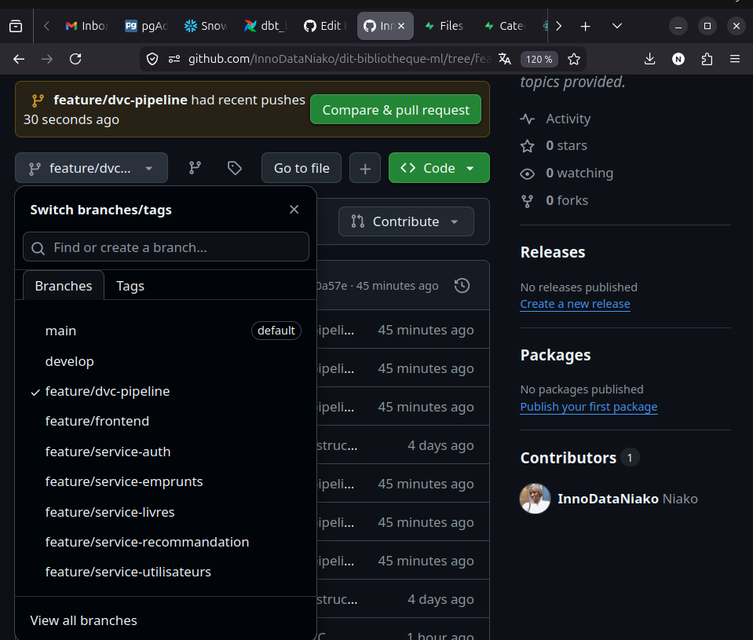

---

##  Installation et lancement

### Prérequis

- Docker & Docker Compose
- Python 3.9+
- Git

### Lancement rapide

```bash
# 1. Cloner le projet
git clone https://github.com/InnoDataNiako/dit-bibliotheque-ml.git
cd dit-bibliotheque-ml

# 2. Lancer tous les services
docker compose --profile dev up -d

# 3. Accéder au frontend
open http://localhost:3000
```

### Services exposés

| Service | URL |
|---------|-----|
| Frontend | http://localhost:3000 |
| API Auth | http://localhost:8084 |
| API Livres | http://localhost:8081 |
| API Utilisateurs | http://localhost:8082 |
| API Emprunts | http://localhost:8083 |
| API Recommandation IA | http://localhost:8000 |
| PostgreSQL | localhost:5433 |

---

## 📡 Services API

###  Auth (port 8084)
| Méthode | Endpoint | Description |
|---------|----------|-------------|
| POST | `/api/auth/login` | Connexion |
| POST | `/api/auth/register` | Inscription |
| GET | `/api/auth/me` | Profil connecté |
| GET | `/api/auth/users` | Liste utilisateurs (admin) |

###  Livres (port 8081)
| Méthode | Endpoint | Description |
|---------|----------|-------------|
| GET | `/api/livres` | Liste des livres |
| POST | `/api/livres` | Ajouter un livre |
| PUT | `/api/livres/{id}` | Modifier un livre |
| DELETE | `/api/livres/{id}` | Supprimer un livre |
| GET | `/api/livres/search?q=&type=` | Recherche |
| POST | `/api/livres/upload` | Upload image couverture |
| GET | `/api/categories` | Liste catégories |

###  Emprunts (port 8083)
| Méthode | Endpoint | Description |
|---------|----------|-------------|
| GET | `/api/emprunts` | Tous les emprunts |
| POST | `/api/emprunts` | Emprunter un livre |
| PUT | `/api/emprunts/{id}/retour` | Retourner un livre |
| GET | `/api/emprunts/utilisateur/{id}` | Historique utilisateur |
| GET | `/api/emprunts/retards` | Livres en retard |
| GET | `/api/emprunts/export` | Export CSV (ML) |

###  Recommandation IA (port 8000)
| Méthode | Endpoint | Description |
|---------|----------|-------------|
| GET | `/recommandations/{user_id}` | Recommandations personnalisées |
| POST | `/train` | Ré-entraîner le modèle |

---

##  Tests des endpoints API

### Tester le service Auth

# Connexion
curl -X POST http://localhost:8084/api/auth/login \
  -H "Content-Type: application/json" \
  -d '{"email":"admin@dit.sn","password":"admin123"}'

# Inscription
curl -X POST http://localhost:8084/api/auth/register \
  -H "Content-Type: application/json" \
  -d '{"nom":"Test","prenom":"User","email":"test@dit.sn","password":"pass123","role":"etudiant"}'
  
### Tester le service Livres

# Lister les livres
curl http://localhost:8081/api/livres

# Rechercher un livre
curl "http://localhost:8081/api/livres/search?q=Python&type=titre"

# Ajouter un livre
curl -X POST http://localhost:8081/api/livres \
  -H "Content-Type: application/json" \
  -d '{"titre":"Nouveau Livre","auteur":"Auteur","isbn":"123-456"}'

  
### Tester le service Emprunts

  # Emprunter un livre
curl -X POST http://localhost:8083/api/emprunts \
  -H "Content-Type: application/json" \
  -d '{"email":"oumar.ba@dit.sn","livre_id":10}'
  
  # Voir tous les emprunts
  curl http://localhost:8083/api/emprunts
  
  # Export CSV
  curl http://localhost:8083/api/emprunts/export

### Tester le service Recommandation IA

# Entraîner le modèle
curl -X POST http://localhost:8000/train

# Obtenir des recommandations
curl http://localhost:8000/recommandations/1

  
---


##  Système de recommandation IA

### Algorithme

- **SVD (Singular Value Decomposition)** pour la factorisation de matrice
- **KNN** pour les similarités entre livres
- **Cold Start** : recommandations populaires pour les nouveaux utilisateurs

### Métriques

| Version | RMSE | MAE | Utilisateurs | Livres |
|---------|------|-----|--------------|--------|
| v1.0 | 0.5 | 0.25 | 9 | 9 |

---

##  DVC - Data Version Control

### Pipeline (3 étapes)

| Étape | Script | Entrée | Sortie |
|-------|--------|--------|--------|
| **Preprocessing** | `dvc/preprocess.py` | `loans.csv` | `loans_clean.csv` |
| **Entraînement** | `dvc/train.py` | `loans_clean.csv` | `model.pkl` + `metrics.json` |
| **Évaluation** | `dvc/evaluate.py` | `metrics.json` | Console |

### Commandes utiles

```bash
dvc repro          # Exécuter le pipeline
dvc metrics show   # Afficher les métriques
dvc metrics diff   # Comparer deux versions
dvc push           # Pousser vers le remote
```

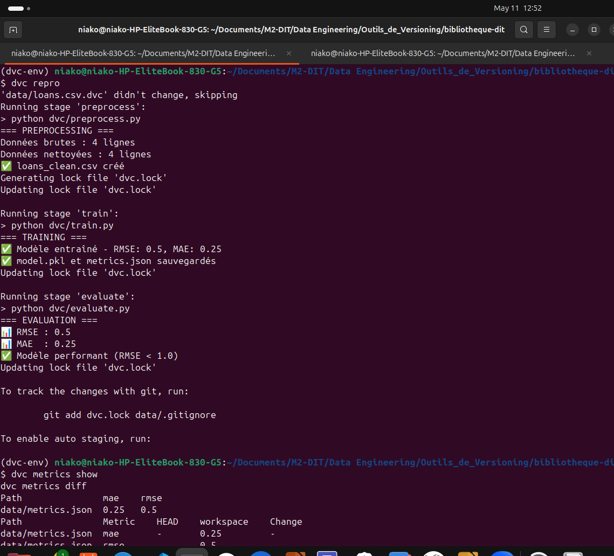
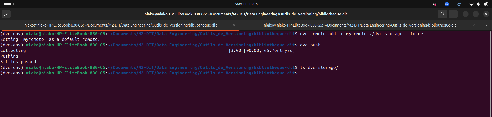

---

## 📸 Captures d'écran

### 👤 Interface Utilisateur

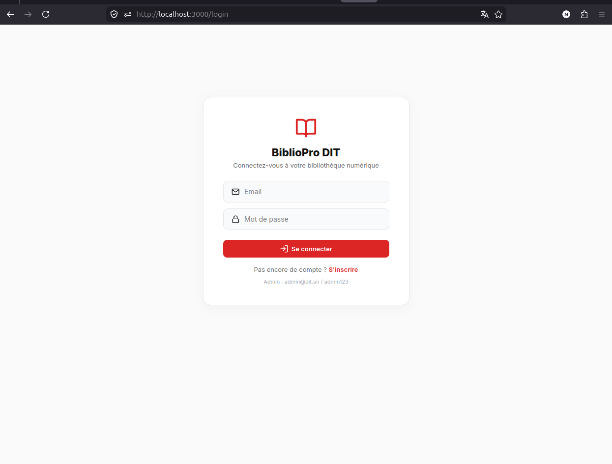 | 

| Accueil | Catalogue | Mes Emprunts |
|---------|-----------|--------------|
| 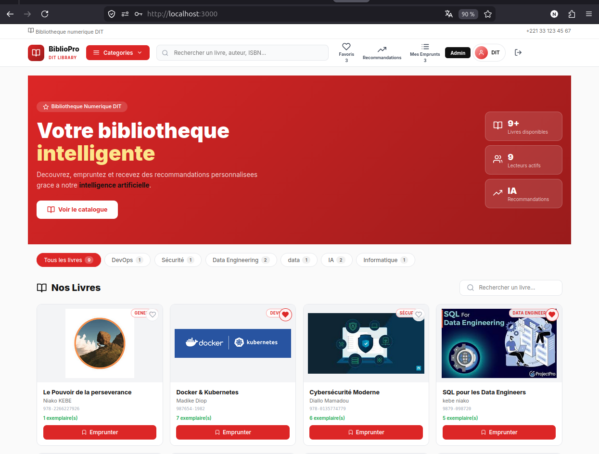 | 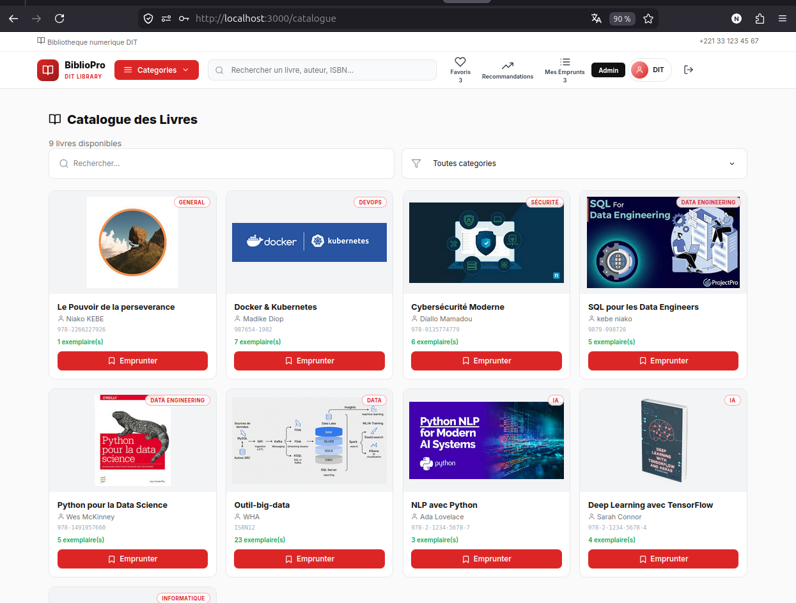 |  |

| Favoris | Recommandations IA | Profil |
|---------|-------------------|--------|
| 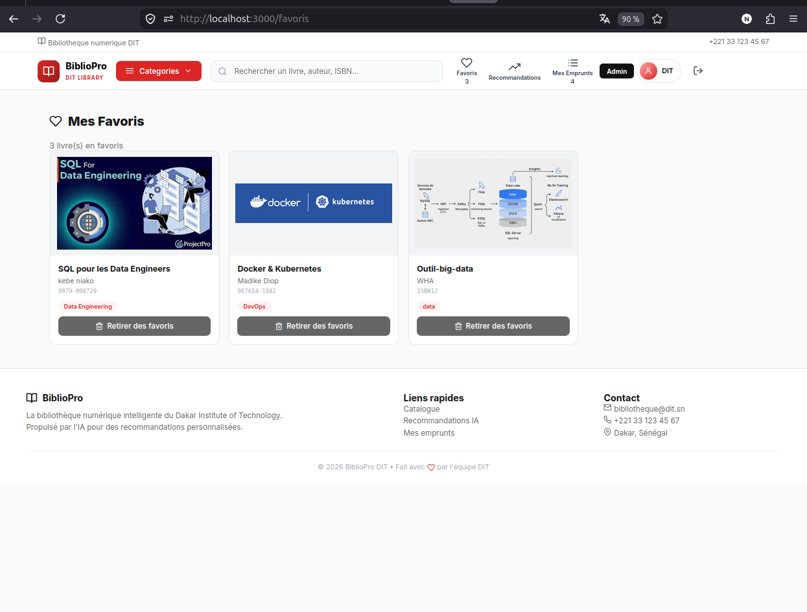 | 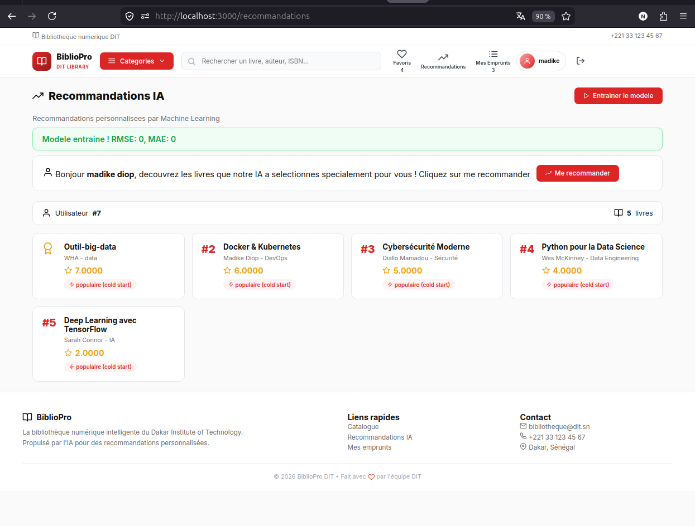 | 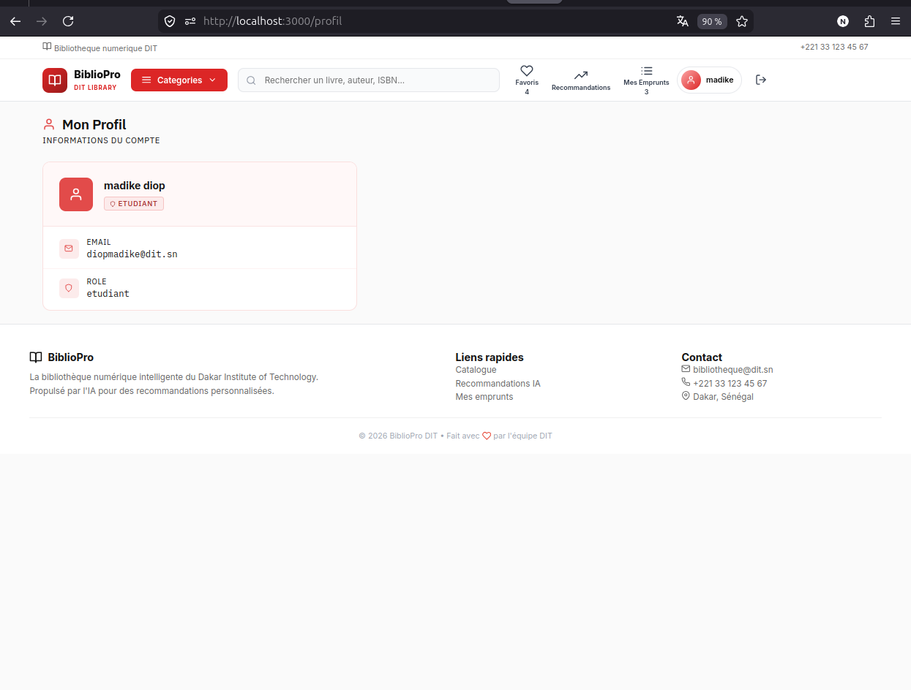 |

###  Interface Admin

| Dashboard | Gérer Livres | Gérer Catégories |
|-----------|--------------|------------------|
|  |  |  |

| Gérer Emprunts | Gérer Utilisateurs | recommandation|
|----------------|-------------------|------------------|
|  | 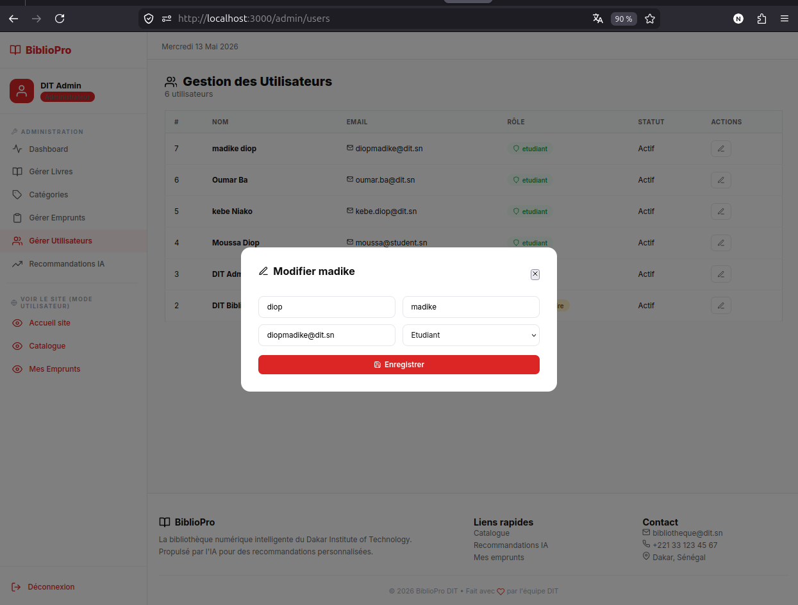 | 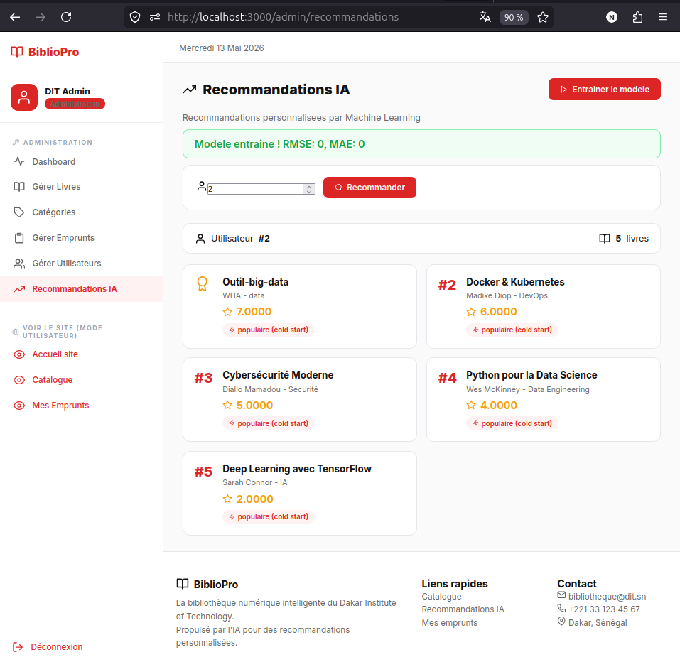 |

### ⚙️ Infrastructure

| Dépôt GitHub | Branches Git | GitHub Actions CI/CD |
|-------------|-------------|---------------------|
|  |  | 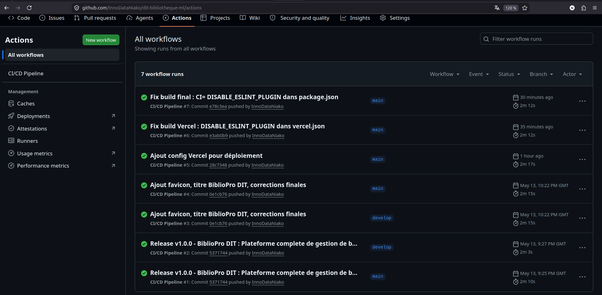 |

| Docker Compose | DVC Pipeline | Login |
|----------------|--------------|-------|
|  |  |  |

---

##  Comptes de test

| Rôle | Email | Mot de passe |
|------|-------|-------------|
| **Admin** | `admin@dit.sn` | `admin123` |
| **Bibliothécaire** | `biblio@dit.sn` | `admin123` |
| **Étudiant** | `moussa@student.sn` | `pass123` |

---

## Auteur

**Niako Kebe**

- Email : kebeniako17@gmail.com
- GitHub : [InnoDataNiako](https://github.com/InnoDataNiako)
---

 🔮 Perspectives d'évolution

-  **Notifications email** : envoi automatique de rappels avant la date de retour et alertes de retard
-  **Scan ISBN** : ajout de livres par scan du code-barres
-  **Application mobile** : version React Native pour iOS et Android
-  **Paiement en ligne** : système d'amendes pour les retards via Wave ou Orange Money
-  **Authentification OAuth2** : connexion via Google, LinkedIn ou comptes universitaires
-  **Tableau de bord avancé** : graphiques d'analyse des emprunts par période, catégorie, utilisateur
-  **Déploiement Kubernetes** : orchestration avancée pour la mise en production à grande échelle
-  **API Gateway** : centralisation des APIs avec rate limiting et monitoring

  ---
  
*VERSION 1 ~ Projet académique - Master  Intelligence Artificielle - Dakar Institute of Technology (DIT) - Mai 2026*
